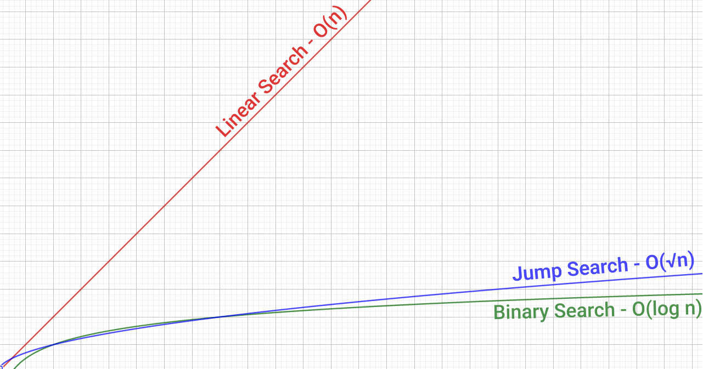

## Search Algorithm

Here have a table with informations about the algorithm and my a link in the name to click and go to my implementation, you can read more about below:

| Algorithm                        | Time Complexity | Space Complexity | Need to be sorted? |
| -------------------------------- | --------------- | ---------------- | ------------------ |
| [Linear Search](./Linear-Search) | O(n)            | O(1)             | No                 |
| [Binary Search](./Binary-Search) | O(log(n))       | O(1)             | Yes                |
| [Jump Search](./Jump-Search)     | O(√n)           | O(1)             | Yes                |

We can see a visual graphic about the complexities in the table in the image below:

We can observe that over time, as the number of elements increases, the search algorithms become considerably faster.

The question is, so why exists more than one algorithm?

A simple reply is because we can implement the best algorithm for our problem, for example, if to sort is a expensive process for your project, but the search is not a expensive process, you could use the linear search, because you probably don't want to sort your data and you will just seldom search elements.

If you have a sorted array you can use the Binary or Jump search, it will depend of your strategy and the problem.
