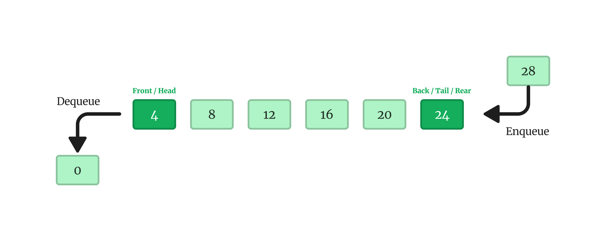
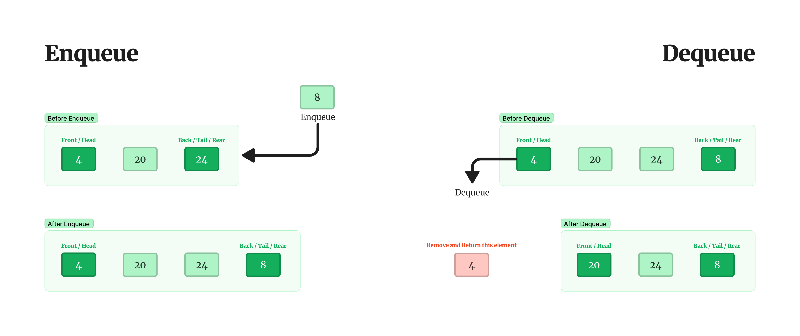
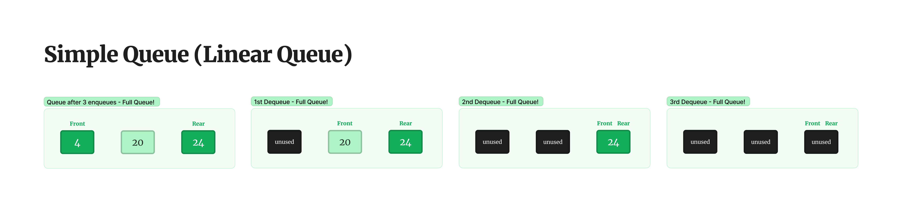

# Queue

## Getting Started

A Queue is a type of list that follows the "First In First Out" (FIFO) rule, meaning that the element which is added first to the list will be the first one to be removed. It's like standing in a queue (line) at a store or a bank, the person who joins first gets served first.

In a Queue, all new elements are added at one end and all deletions are done at the other end. So, think of it like a line of people waiting to be served, new people join at the back of the line, and the person at the front of the line gets served and leaves the line.

A Queue is like a line waiting to purchase tickets, where the first person in line is the first person served. (i.e. First come first serve).

Position of the entry in a queue ready to be served, that is, the first entry that will be removed from the queue, is called the front of the queue(sometimes, head of the queue), similarly, the position of the last entry in the queue, that is, the one most recently added, is called the rear (or the tail) of the queue. See the below figure.

Enqueue is the operation of adding a new element to the back of the queue. It's like adding a new person to the end of a line.

Dequeue, on the other hand, is the operation of removing the front element from the queue. It's like the person at the front of the line getting served and leaving the line.

- **Queue**: the name of the array storing queue elements.
- **Front**: the index where the first element is stored in the array representing the queue.
- **Rear**: the index where the last element is stored in an array representing the queue.

## Implementation

To implement a Queue is necessary to know some types of Queues, for this study I got the **Simple Queue (Linear Queue)**, **Circular Queue** and the **Deque**.

### Simple Queue (Linear Queue)

In a simple queue, you can add new elements to the end of the queue using the "enqueue" operation, and remove the first element from the front of the queue using the "dequeue" operation.

Simple queues can be implemented using either a static array or a dynamic linked list. However, with a static array, changing the index of the first element can be inefficient because it can leave unused space in the array.

In other words, the simple queue does not reuse the memory space of the dequeued elements, which means that once an element is dequeued, its memory space remains unused. This can be advantageous if the program does not need to reuse the memory space, but it can also lead to memory wastage if the program runs for a long time or if the queue is frequently used.

The Circular Queue exists solve the cause of unused space in Simple Queue.

Here's the table of the methods for the Simple Queue:

| Method    | Description                                                        |
| --------- | ------------------------------------------------------------------ |
| `enqueue` | Inserts an element at the back of the queue.                       |
| `dequeue` | Removes and returns the element at the front of the queue.         |
| `isEmpty` | Returns true if the queue is empty, false otherwise.               |
| `isFull`  | Returns true if the queue is full, false otherwise.                |
| `front`   | Returns the element at the front of the queue without removing it. |
| `size`    | Returns the number of elements in the queue.                       |

### Circular Queue

The Circular Queue is the Simple Queue, but with the solution to the unused memory, here is possible to enqueue and dequeue elements and here is possible even after dequeue all element to enqueue new elements.

> Circular Queue image from [Geeks For Geeks](https://www.geeksforgeeks.org/introduction-to-circular-queue/)

### Deque

In some cases, it makes sense to remove elements from both sides, the front and the rear of the queue, an example of implementation is the queue of a restaurant.

The first person in the queue can be removed, but when called, there may not be a table available, in which case the first person should go back to their place in the queue (1);

The last person in the queue may become impatient and leave the queue. It can be implemented statically or dynamically.

Note: Deque stands for "double-ended queue", which means a data structure that allows insertion and deletion at both the front and the rear.

| Method            | Description                                                |
| ----------------- | ---------------------------------------------------------- |
| `enqueueFront(x)` | Inserts element `x` at the front of the queue              |
| `dequeueFront()`  | Removes and returns the first element in the queue         |
| `enqueueRear(x)`  | Inserts element `x` at the rear of the queue               |
| `dequeueRear()`   | Removes and returns the last element in the queue          |
| `isEmpty()`       | Returns `true` if the queue is empty, `false` otherwise    |
| `isFull()`        | Returns `true` if the queue is full, `false` otherwise     |
| `front()`         | Returns the first element in the queue without removing it |
| `size()`          | Returns the number of elements in the queue                |

## Implementation with Code

### Static Queue

| Algorithm                                           | Description                                                                                                                   |
| --------------------------------------------------- | ----------------------------------------------------------------------------------------------------------------------------- |
| [Linear Queue](./Static/python/Linear-Queue.py)     | The linear queue work just one time, e.g. after add 3 element and remove them, the Linear Queue cannot enqueue more elements. |
| [Circular Queue](./Static/python/Circular-Queue.py) | The circular queue fix the linear queue problems, when remove elements the circular queue allow add new elements.             |
| [Deque (not finished)](./Static/python/Deque.py)    | Allow to remove and insert elements in front() and rear()                                                                     |

### Dynamic Queue

| Algorithm                          | Description                        |
| ---------------------------------- | ---------------------------------- |
| [Queue](./Dynamic/python/Queue.py) | A queue with linked list and node. |
