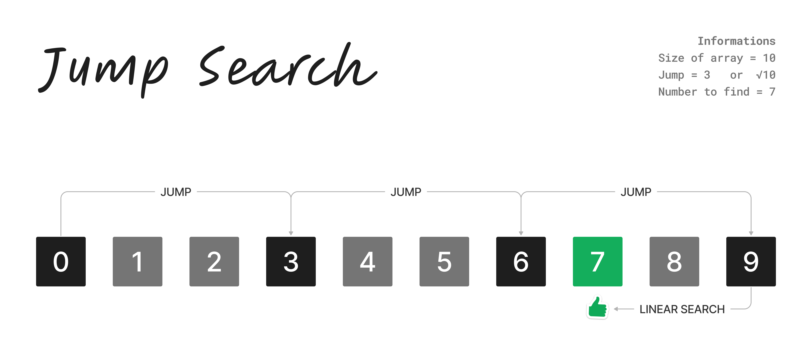

## Jump Search



> Jump Search Example by [Rickelme Dias](https://github.com/RickelmeDias)

#### How it works?

_To use the Jump Search the array needs to be **sorted!**_

In the Jump Search we get the square root of array size as a jump size, in the image above the array has a size of 10 (elements), so the jump size is:

$$JumpSize = \sqrt{10}$$

Considering that square root of 10 is about 3.162... We will consider the jump size is 3.

The algorithm will skip 3 spaces and compare the current value with the searched value, like this:

- If the current value is equal to the fetched value, then it found
- If the current value is greater than the fetched value, then it will perform a linear search from the current position up to - 3 positions
- If the current value is less than the fetched value, then it will skip 3 spaces and repeat the previous steps

Jump search can be an effective algorithm for searching large, sorted arrays. However, it is not suitable for unsorted arrays or for dynamic data structures where the size of the array can change frequently.

#### Complexity

Best case O(1):

- Find the element in the first position of array

Worst case O(√n):

- In the image example we have the worst case, because it execute all possible jumps and one linear search, but in asymptotic analysis, we can also consider worst cases these cases below:
  - Find the element in the last position of array
  - This element is not in the array

#### Pseudocode

```pseudocode
Start
    Declare Array<Integer> array_of_numbers = [0, 1, 2, 3, 4, 5, 6, 7, 8, 9]
    Declare Integer number_to_find = input("What number do you want find?: ")

    Declare Integer array_size = size(array_of_numbers)
    Declare Integer blockSize = sqrt(array_size)
    Declare Integer start = 0
    Declare Integer end = blockSize

    While end < array_size - 1 && array_of_numbers[end] <= number_to_find
        start = end
        end = end + blockSize
        If end > array_size - 1
            end = array_size - 1

    For i = end; i >= start; i--
        If array_of_numbers[end] == number_to_find
            Return true

    Return false
End
```

#### Algorithm Implementation

You can see this implementation in other language too. Here some implementations that I did:

- [C++ Jump Search](./cpp/JumpSearch.cpp)
- [Python Jump Search](./python/JumpSearch.py)
