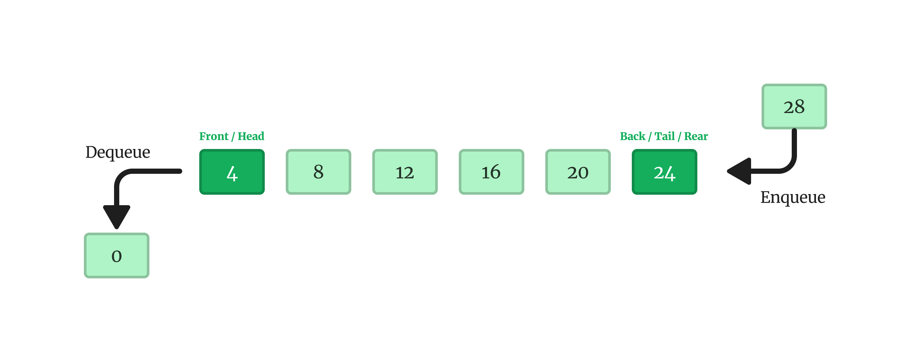
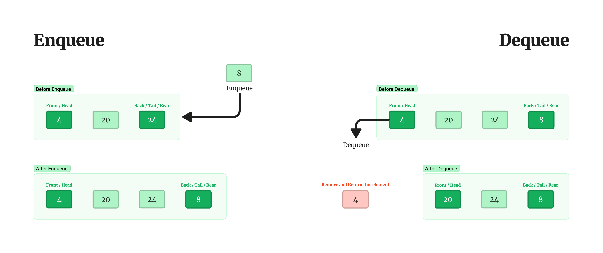

# Queue

## Getting Started

A Queue is a type of list that follows the "First In First Out" (FIFO) rule, meaning that the element which is added first to the list will be the first one to be removed. It's like standing in a queue (line) at a store or a bank, the person who joins first gets served first.

In a Queue, all new elements are added at one end and all deletions are done at the other end. So, think of it like a line of people waiting to be served, new people join at the back of the line, and the person at the front of the line gets served and leaves the line.

A Queue is like a line waiting to purchase tickets, where the first person in line is the first person served. (i.e. First come first serve).

Position of the entry in a queue ready to be served, that is, the first entry that will be removed from the queue, is called the front of the queue(sometimes, head of the queue), similarly, the position of the last entry in the queue, that is, the one most recently added, is called the rear (or the tail) of the queue. See the below figure.

Enqueue is the operation of adding a new element to the back of the queue. It's like adding a new person to the end of a line.

Dequeue, on the other hand, is the operation of removing the front element from the queue. It's like the person at the front of the line getting served and leaving the line.

- **Queue**: the name of the array storing queue elements.
- **Front**: the index where the first element is stored in the array representing the queue.
- **Rear**: the index where the last element is stored in an array representing the queue.

## Implementation

### Static Queue

| Algorithm                                           | Description                                                                                                                   |
| --------------------------------------------------- | ----------------------------------------------------------------------------------------------------------------------------- |
| [Linear Queue](./Static/python/Linear-Queue.py)     | The linear queue work just one time, e.g. after add 3 element and remove them, the Linear Queue cannot enqueue more elements. |
| [Circular Queue](./Static/python/Circular-Queue.py) | The circular queue fix the linear queue problems, when remove elements the circular queue allow add new elements.             |
| [Deque](./Static/python/Deque.py)                   | Allow to remove elements from front() and rear()                                                                              |

### Dynamic Queue
