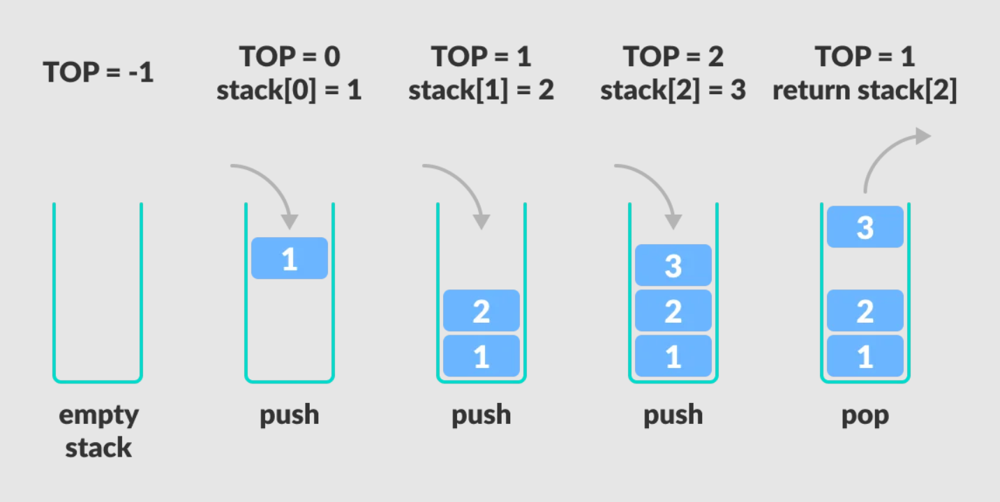
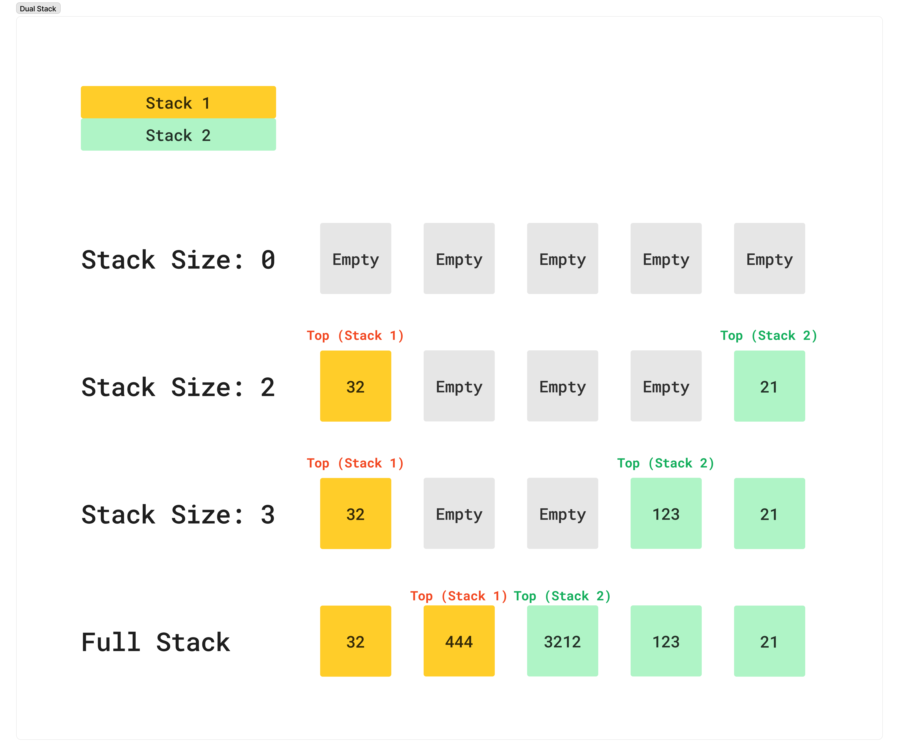

# Stack

## Getting Started

A stack is like a pile of items that are arranged on top of each other. When you add a new item to the stack, it is placed on top of the previous item. When you remove an item from the stack, you can only remove the top item. This is because the stack follows the Last In, First Out (LIFO) principle.

To add an item to the stack, you use the push operation. This operation adds the item to the top of the stack. To remove an item from the stack, you use the pop operation. This operation removes the top item from the stack.

You can also use the peek or top operation to see the top item in the stack without removing it. The isEmpty operation checks if the stack is empty.

A stack is commonly used in programming for function call management, backtracking, and expression evaluation. It is a simple yet powerful data structure that has many practical applications.

- **Push**: insert a new element in the top of the stack.
- **Pop**: remove the top element from stack and show the element removed.
- **Top**: show the top element without remove it.

## Implementation

In this case I made two types of Stack, a normal **Stack** and a **Dual Stack**.

### Stack

It is a simple stack that you can Push elements and Pop, like the image above.

Here's the table of the methods for this Stack:

| Method    | Description                                                  |
| --------- | ------------------------------------------------------------ |
| `push`    | Inserts an element on the top of the stack.                  |
| `pop`     | Removes the element from top and returns the element.        |
| `isEmpty` | Returns true if the stack is empty, false otherwise.         |
| `isFull`  | Returns true if the stack is full, false otherwise.          |
| `top`     | Returns the element on the top of stack without removing it. |
| `size`    | Returns the number of elements in the stack.                 |

### Dual Stack

It is a other exercise of Stack, the ideia is to have two Stacks in a unique stack.

1. The first stack starts of the left to the right.
2. The second stack starts of the right to the left.

The two stacks will compete for the same amount of space.
Example:

## Implementation with Code

- [Stack.py](./python/Stack.py)
- [Dual Stack.py](./python/DualStack.py)
